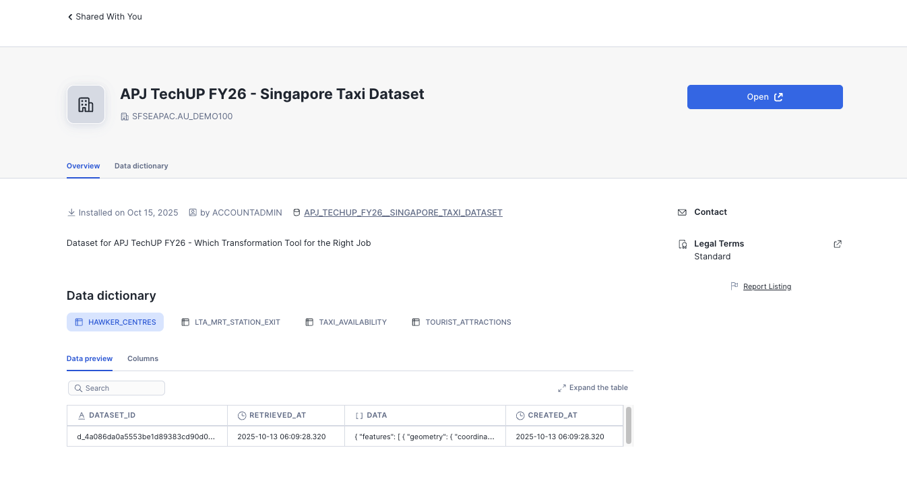
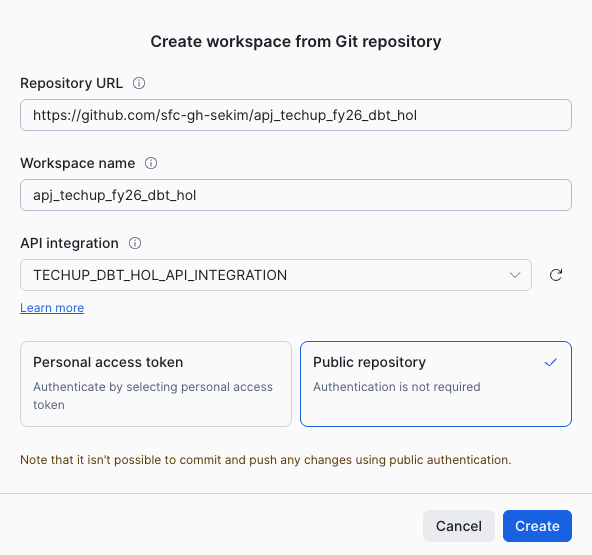
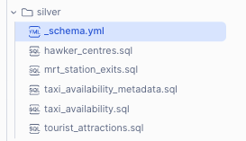
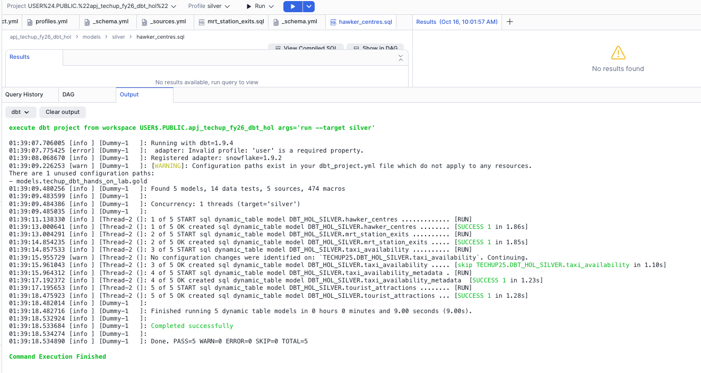
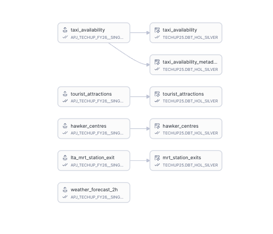

# TechUP FY26 - dbt Workspaces Hands-On Lab
## Singapore Taxi Availability Data Transformation Pipeline

This hands-on lab demonstrates how to use **dbt Projects on Snowflake** (Workspaces) to build a data transformation pipeline using real-time Singapore transportation and location data. Learn how to transform raw GeoJSON data into structured, queryable datasets using dbt Core directly within Snowflake.

> 📚 **Reference Documentation**: [dbt Projects on Snowflake](https://docs.snowflake.com/en/user-guide/data-engineering/dbt-projects-on-snowflake)

---

## 📋 Table of Contents

- [Overview](#overview)
- [Architecture](#architecture)
- [Prerequisites](#prerequisites)
- [Setup Instructions](#setup-instructions)
  - [Step 1: Get Dataset from Private Listing](#step-1-get-dataset-from-private-listing)
  - [Step 2: Run Initial Setup](#step-2-run-initial-setup)
  - [Step 3: Create Workspace from Git](#step-3-create-workspace-from-git)
  - [Step 4: Understanding the Silver Layer](#step-4-understanding-the-silver-layer)
  - [Step 5: Run the dbt Project](#step-5-run-the-dbt-project)
  - [Step 6: View the Data Lineage](#step-6-view-the-data-lineage)
- [Project Structure](#project-structure)
- [Data Models](#data-models)
- [Key Concepts](#key-concepts)
- [Troubleshooting](#troubleshooting)

---

## 🎯 Overview

This lab teaches you how to:
- ✅ Use **dbt Workspaces** in Snowflake (Preview Feature)
- ✅ Transform raw GeoJSON data into structured tables
- ✅ Create **Dynamic Tables** as dbt models
- ✅ Build a **medallion architecture** (Bronze → Silver → Gold)
- ✅ Work with **Singapore open data** (real-time taxi locations, hawker centres, MRT stations)
- ✅ Leverage Snowflake's **GEOGRAPHY** data type for spatial data
- ✅ Use **Git integration** for version control
- ✅ Deploy dbt projects directly in Snowflake

### What You'll Build

A data pipeline that processes:
- 🚕 **Real-time taxi availability** (updated every minute)
- 🍜 **Hawker centres** locations and details
- 🚇 **MRT station exits** with coordinates
- 🏛️ **Tourist attractions** with metadata
- 🌤️ **Weather forecasts** (2-hour predictions)

---

## 🏗️ Architecture

```
┌─────────────────────────────────────────────────────────────────┐
│  Bronze Layer (Raw Data)                                        │
│  APJ_TECHUP_FY26__SINGAPORE_TAXI_DATASET.RAW_DATA              │
│  - taxi_availability (GeoJSON, every 1 min)                    │
│  - hawker_centres (GeoJSON, daily)                             │
│  - lta_mrt_station_exit (GeoJSON, daily)                       │
│  - tourist_attractions (GeoJSON, daily)                        │
│  - weather_forecast_2h (JSON, every 30 min)                    │
└─────────────────────────────────────────────────────────────────┘
                              ↓
                    ┌─────────────────┐
                    │   dbt Models    │
                    │  (Workspaces)   │
                    └─────────────────┘
                              ↓
┌─────────────────────────────────────────────────────────────────┐
│  Silver Layer (Cleaned & Structured)                            │
│  TECHUP25.DBT_HOL_SILVER                                        │
│  - taxi_availability (lat/long as GEOGRAPHY)                    │
│  - taxi_availability_metadata (timestamps & counts)             │
│  - hawker_centres (parsed properties)                           │
│  - mrt_station_exits (extracted from HTML)                      │
│  - tourist_attractions (structured attributes)                  │
│                                                                  │
│  Materialized as: DYNAMIC TABLES                                │
│  Refresh: target_lag = downstream / 1 minute                    │
└─────────────────────────────────────────────────────────────────┘
                              ↓
┌─────────────────────────────────────────────────────────────────┐
│  Gold Layer (Business Logic & Aggregations)                     │
│  TECHUP25.DBT_HOL_GOLD                                          │
│  - [Your aggregated models here]                                │
│                                                                  │
│  Materialized as: DYNAMIC TABLES                                │
│  Refresh: target_lag = 24 HOURS                                 │
└─────────────────────────────────────────────────────────────────┘
```

---

## ✅ Prerequisites

- Snowflake account (Enterprise Edition or higher recommended)
- `ACCOUNTADMIN` privileges (for initial setup)
- Git repository access (GitHub, GitLab, etc.)
- Basic understanding of:
  - SQL
  - dbt concepts (models, sources, tests)
  - GeoJSON format

---

## 🚀 Setup Instructions

### Step 1: Get Dataset from Private Listing

1. Navigate to **Data Products** → **Private Sharing** in Snowsight
2. Search for **"APJ TechUP FY26 - Singapore Taxi Dataset"**
3. Click on the listing: `APJ_TECHUP_FY26__SINGAPORE_TAXI_DATASET`



4. Click **"Open"** to access the shared data
5. Verify you can see these tables:
   - `HAWKER_CENTRES`
   - `LTA_MRT_STATION_EXIT`
   - `TAXI_AVAILABILITY`
   - `TOURIST_ATTRACTIONS`
   - `WEATHER_FORECAST_2H`

> 💡 **Note**: This is a **private listing** shared specifically for this lab. The data is continuously updated from Singapore's data.gov.sg APIs.

---

### Step 2: Run Initial Setup

1. Open a **SQL Worksheet** in Snowsight
2. Copy the contents of [`setup.sql`](setup.sql)
3. **Update line 47** with your GitHub username:
   ```sql
   API_ALLOWED_PREFIXES = ('https://github.com/<YOUR_GITHUB_USERNAME>')
   ```
4. Run the entire script



**What This Script Does:**

✅ Creates database `TECHUP25` and warehouse `TECHUP25_WH`  
✅ Creates role `TECHUP25_RL` with appropriate privileges  
✅ Creates schemas:
   - `DBT_HOL_SILVER` - for cleaned, structured data
   - `DBT_HOL_GOLD` - for aggregated, business-ready data
   - `PROJECTS` - for dbt project objects and Streamlit apps

✅ Creates database roles:
   - `DBT_HOL_TRANSFORM` - for running dbt transformations
   - `DBT_HOL_READER` - for reading gold layer data

✅ Sets up **Git API Integration** for connecting to your repository

---

### Step 3: Create Workspace from Git

1. In Snowsight, navigate to **Projects** → **Workspaces**
2. Click **"+ Workspace"** → **"Create from Git Repository"**
3. Fill in the details:

   | Field | Value |
   |-------|-------|
   | **Repository URL** | `https://github.com/<your-username>/apj_techup_fy26_dbt_hol` |
   | **Workspace name** | `apj_techup_fy26_dbt_hol` |
   | **API Integration** | `MY_GIT_API_INTEGRATION` |
   | **Authentication** | Public repository (no token needed) |

4. Click **"Create"**


5. Wait for the workspace to initialize (should take ~30 seconds)
6. You should see the project files load in the left sidebar

---

### Step 4: Understanding the Silver Layer

The **Silver Layer** contains cleaned and structured data models. Navigate to the `models/silver/` folder in your workspace:



#### 📁 Silver Layer Files

| File | Purpose |
|------|---------|
| **`_schema.yml`** | Defines model documentation, tests, and column descriptions |
| **`hawker_centres.sql`** | Transforms raw GeoJSON into structured hawker centre data |
| **`mrt_station_exits.sql`** | Extracts MRT station exit information from HTML descriptions |
| **`taxi_availability.sql`** | Flattens coordinate arrays into individual taxi location records |
| **`taxi_availability_metadata.sql`** | Extracts summary statistics (timestamp, taxi count, API status) |
| **`tourist_attractions.sql`** | Parses tourist attraction details from HTML descriptions |

#### 🔍 Example Transformation: `taxi_availability.sql`

This model transforms raw GeoJSON taxi data into a flat table:

```sql
{{ config(target_lag="1 minute") }}

select 
    ta.DATA:features[0]:properties:timestamp::timestamp as timestamp, 
    st_makepoint(f.value[0], f.value[1]) as taxi_coords
from {{ source('raw_data', 'taxi_availability') }} ta,
lateral flatten(input => ta.DATA:features[0]:geometry:coordinates) f
```

**What it does:**
1. Extracts the timestamp from the GeoJSON properties
2. Flattens the coordinate array (each taxi has [longitude, latitude])
3. Uses `ST_MAKEPOINT()` to create Snowflake GEOGRAPHY objects
4. Configures as a **Dynamic Table** with **1-minute refresh lag**

#### 🔍 Example Transformation: `hawker_centres.sql`

```sql
select 
    f.value:properties:OBJECTID::varchar as objectid,
    f.value:properties:NAME::varchar as name,
    f.value:properties:ADDRESS_MYENV::varchar as address,
    f.value:properties:ADDRESSSTREETNAME::varchar as street_name,
    f.value:properties:ADDRESSPOSTALCODE::varchar as postcode,
    f.value:properties:NUMBER_OF_COOKED_FOOD_STALLS::int as num_cooked_food_stalls,
    f.value:properties:PHOTOURL::varchar as photo_url,
    st_makepoint(f.value:geometry:coordinates[0], f.value:geometry:coordinates[1]) as coords,
    hc.DATA
from {{ source('raw_data', 'hawker_centres') }} hc,
lateral flatten(input => hc.DATA:features) f
```

**What it does:**
1. Flattens the GeoJSON features array
2. Extracts all relevant properties (name, address, stalls count)
3. Creates GEOGRAPHY point from coordinates
4. Preserves original raw data for reference

#### 🎯 Key Transformation Techniques

1. **LATERAL FLATTEN** - Unnests arrays in VARIANT columns
2. **ST_MAKEPOINT()** - Converts coordinates to GEOGRAPHY type
3. **REGEX_SUBSTR()** - Extracts data from HTML descriptions
4. **Type Casting** - Converts VARIANT to specific data types
5. **dbt Sources** - References raw tables using `{{ source() }}`

---

### Step 5: Run the dbt Project

1. In your workspace, set the **Profile** to `silver` (top right dropdown)
2. Click the **Run** button (or press ▶️)
3. In the command dropdown, select: `run --target silver`



4. Click **Execute**

**What Happens:**

```bash
execute dbt project from workspace USERS.PUBLIC.apj_techup_fy26_dbt_hol 
  args='run --target silver'
```

The dbt engine will:
1. ✅ Parse your dbt project (`dbt_project.yml`)
2. ✅ Compile SQL models with Jinja templates
3. ✅ Run data quality tests (14 tests defined in `_schema.yml`)
4. ✅ Create **5 Dynamic Tables** in `TECHUP25.DBT_HOL_SILVER`:
   - `hawker_centres`
   - `mrt_station_exits`
   - `taxi_availability`
   - `taxi_availability_metadata`
   - `tourist_attractions`

5. ✅ Display execution results with timing

**Expected Output:**
```
[SUCCESS 1 in 1.86s] - hawker_centres
[SUCCESS 1 in 1.85s] - mrt_station_exits
[SUCCESS 1 in 1.10s] - taxi_availability
[SUCCESS 1 in 1.23s] - taxi_availability_metadata
[SUCCESS 1 in 1.28s] - tourist_attractions

Completed successfully
Done. PASS=5 WARN=0 ERROR=0 SKIP=0 TOTAL=5
```

> 🎉 **Congratulations!** You've successfully deployed your first dbt project in Snowflake Workspaces!

---

### Step 6: View the Data Lineage

1. In your workspace, click on the **"DAG"** tab (next to Query History)
2. You'll see a visual representation of your data lineage:



**Understanding the DAG:**

- **Left side (Source tables)**: Raw data from the private listing
  - `taxi_availability`
  - `tourist_attractions`
  - `hawker_centres`
  - `lta_mrt_station_exit`
  - `weather_forecast_2h`

- **Right side (dbt models)**: Your transformed silver tables
  - Each arrow shows data flowing from source → model
  - Tables are created in `TECHUP25.DBT_HOL_SILVER` schema

**Key Features:**
- 🔄 **Automatic refresh**: Dynamic Tables refresh based on `target_lag` settings
- 📊 **Data quality**: All models have tests ensuring data integrity
- 🗺️ **Spatial data**: All location models use Snowflake's native GEOGRAPHY type
- ⚡ **Incremental refresh**: Only changed data is processed

---

## 📂 Project Structure

```
apj_techup_fy26_dbt_hol/
│
├── dbt_project.yml           # Project configuration & materialization settings
├── profiles.yml              # Connection profiles (silver, gold targets)
├── setup.sql                 # Initial Snowflake setup script
│
├── models/
│   ├── _sources.yml          # Source table definitions from raw data
│   │
│   ├── silver/               # 🥈 Silver Layer - Cleaned & Structured
│   │   ├── _schema.yml       # Model documentation & tests
│   │   ├── hawker_centres.sql
│   │   ├── mrt_station_exits.sql
│   │   ├── taxi_availability.sql
│   │   ├── taxi_availability_metadata.sql
│   │   └── tourist_attractions.sql
│   │
│   └── gold/                 # 🥇 Gold Layer - Business Logic
│       ├── _schema.yml
│       └── [Your aggregated models]
│
├── macros/                   # Custom Jinja macros
├── tests/                    # Custom data tests
├── seeds/                    # CSV files to load as tables
├── snapshots/                # Type-2 SCD snapshots
├── analyses/                 # Ad-hoc analysis queries
│
└── images/                   # Documentation images
    ├── 1_marketplace.png
    ├── 2_setup.png
    ├── 3_silver.png
    ├── 4_run_silver.png
    └── 5_silver_dag.png
```

---

## 📊 Data Models

### Silver Layer Models

| Model | Source | Rows (approx) | Refresh | Description |
|-------|--------|---------------|---------|-------------|
| **taxi_availability** | `taxi_availability` | ~10,000/min | 1 minute | Individual taxi coordinates with timestamps |
| **taxi_availability_metadata** | `taxi_availability` | ~1/min | 1 minute | Summary stats: taxi count, timestamp, API status |
| **hawker_centres** | `hawker_centres` | ~120 | downstream | Hawker centre locations with stall counts |
| **mrt_station_exits** | `lta_mrt_station_exit` | ~500 | downstream | MRT/LRT station exit coordinates |
| **tourist_attractions** | `tourist_attractions` | ~200 | downstream | Tourist sites with descriptions and hours |

### Gold Layer Models (To Be Implemented)

Potential gold layer aggregations:
- 📍 Taxi availability by region (hourly aggregates)
- 🗺️ Nearest hawker centres to MRT exits (spatial joins)
- 🏆 Top tourist areas with highest taxi density
- 📈 Taxi demand trends over time
- 🌧️ Weather impact on taxi availability

---

## 🔑 Key Concepts

### 1️⃣ dbt Workspaces in Snowflake

**What is it?**
A web-based IDE built into Snowflake that lets you:
- Edit dbt project files directly in the browser
- Connect to Git repositories for version control
- Run dbt commands without installing dbt locally
- Deploy dbt projects as Snowflake objects
- Visualize data lineage with DAG view

**Key Commands:**
```bash
# Run all models
dbt run

# Run with specific target (silver or gold)
dbt run --target silver

# Run specific model
dbt run --select hawker_centres

# Run tests
dbt test

# View compiled SQL
dbt compile

# Show lineage
dbt docs generate
```

### 2️⃣ Dynamic Tables

**What are they?**
Dynamic Tables are Snowflake's **declarative data pipelines**:
- Automatically refresh based on `target_lag` setting
- Use incremental refresh (only process changes)
- Support complex DAG dependencies
- Handle schema evolution gracefully

**Configuration:**
```yaml
models:
  techup_dbt_hands_on_lab:
    silver:
      +materialized: dynamic_table          # Use Dynamic Tables
      +snowflake_warehouse: TECHUP25_WH    # Compute warehouse
      +target_lag: downstream               # Refresh when downstream needs it
      +refresh_mode: INCREMENTAL            # Only process changes
      +initialize: ON_CREATE                # Populate on creation
```

**Target Lag Options:**
- `downstream` - Refresh when consuming models need data
- `1 minute` - Refresh every minute (for real-time data)
- `24 HOURS` - Daily refresh (for historical data)

### 3️⃣ Medallion Architecture

**Bronze → Silver → Gold**

| Layer | Purpose | Transformations | Materialization |
|-------|---------|-----------------|-----------------|
| **Bronze** | Raw data | None (landed as-is) | External/Base Tables |
| **Silver** | Cleaned data | Parse JSON, type cast, flatten | Dynamic Tables |
| **Gold** | Business logic | Aggregations, joins, metrics | Dynamic Tables |

### 4️⃣ Snowflake GEOGRAPHY Type

All location models use `ST_MAKEPOINT(longitude, latitude)` to create native GEOGRAPHY objects:

**Benefits:**
- 🌍 Native spatial functions (distance, containment, intersections)
- 📍 Optimized storage and indexing
- 🔍 Easy integration with mapping tools
- 🚀 Fast geospatial queries

**Example Query:**
```sql
-- Find nearest hawker centre to a taxi
SELECT 
    h.name,
    ST_DISTANCE(t.taxi_coords, h.coords) as distance_meters
FROM taxi_availability t
CROSS JOIN hawker_centres h
QUALIFY ROW_NUMBER() OVER (PARTITION BY t.timestamp ORDER BY distance_meters) = 1;
```

### 5️⃣ Data Quality Tests

Tests are defined in `_schema.yml`:

```yaml
columns:
  - name: objectid
    tests:
      - not_null       # Column cannot be NULL
      - unique         # Values must be unique
  - name: coords
    tests:
      - not_null       # Geography point must exist
```

**Run tests:**
```bash
dbt test                      # Run all tests
dbt test --select hawker_centres  # Test one model
```

---

## 🛠️ Troubleshooting

### Issue: "Invalid profile: 'user' is a required property"

**Solution:** This is expected! dbt Workspaces runs under your current user context, so `user` and `account` can be left empty in `profiles.yml`.

---

### Issue: Dynamic Table not refreshing

**Solution:**
1. Check the warehouse is running: `SHOW WAREHOUSES LIKE 'TECHUP25_WH';`
2. Verify target_lag setting in `dbt_project.yml`
3. Manually refresh: `ALTER DYNAMIC TABLE <table_name> REFRESH;`

---

### Issue: "Configuration paths exist which do not apply to any resources"

**Cause:** You have `gold` configuration but no models in the gold folder yet.

**Solution:** Either:
1. Create gold models, or
2. Comment out the gold section in `dbt_project.yml` temporarily

---

### Issue: Git integration not working

**Solution:**
1. Verify API integration is created: `SHOW API INTEGRATIONS;`
2. Check the allowed prefixes match your Git URL
3. Ensure repository is public (or configure Personal Access Token)

---

### Issue: Source tables not found

**Solution:**
1. Verify you have access to the private listing: `SHOW DATABASES LIKE 'APJ_TECHUP_FY26%';`
2. Check the database and schema names in `models/_sources.yml`
3. Grant necessary privileges: `GRANT USAGE ON DATABASE APJ_TECHUP_FY26__SINGAPORE_TAXI_DATASET TO ROLE TECHUP25_RL;`

---

## 📚 Additional Resources

- [dbt Projects on Snowflake Documentation](https://docs.snowflake.com/en/user-guide/data-engineering/dbt-projects-on-snowflake)
- [Snowflake Dynamic Tables](https://docs.snowflake.com/en/user-guide/dynamic-tables-intro)
- [dbt Core Documentation](https://docs.getdbt.com/docs/introduction)
- [Singapore Open Data Portal](https://data.gov.sg/)
- [Snowflake Geography Functions](https://docs.snowflake.com/en/sql-reference/functions-geospatial)

---

## 🎓 Learning Objectives Achieved

By completing this lab, you've learned how to:

✅ Access and work with private data listings in Snowflake  
✅ Set up dbt Workspaces with Git integration  
✅ Transform raw GeoJSON data into structured tables  
✅ Use Dynamic Tables for automated data pipelines  
✅ Implement medallion architecture (bronze/silver/gold)  
✅ Work with Snowflake's GEOGRAPHY data type  
✅ Deploy dbt projects directly in Snowflake  
✅ Visualize data lineage with DAG views  
✅ Write data quality tests in dbt  
✅ Use database roles for access control  

---

## 🚀 Next Steps

1. **Build Gold Layer Models**: Create aggregated views for business analytics
2. **Add More Tests**: Implement custom data quality checks
3. **Create a Streamlit App**: Visualize taxi availability on a map
4. **Schedule Refreshes**: Use Snowflake Tasks to orchestrate refreshes
5. **Implement Alerting**: Get notified when data quality tests fail
6. **Optimize Performance**: Add clustering keys and materialized views
7. **Deploy to Production**: Use CI/CD with Snowflake CLI

---

## 👥 Contributors

- **TechUP FY26 APJ Team**
- Data source: [data.gov.sg](https://data.gov.sg/)

---

## 📄 License

This project is for educational purposes as part of the TechUP FY26 training program.

---

**Happy transforming! 🎉**

For questions or issues, please contact your TechUP instructor.
