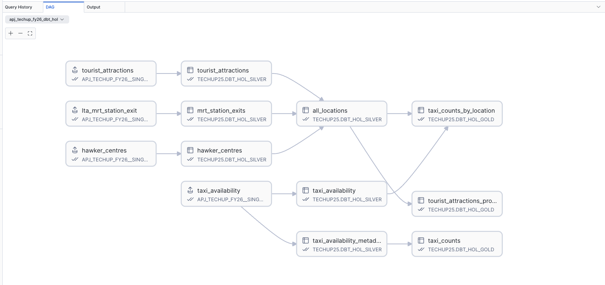

# HOL Instructions
## Singapore Taxi Availability Data Transformation Pipeline

This guide walks you through setting up the dbt project on Snowflake Workspaces to transform Singapore transportation and location data.

By the end of this HOL you should walk away with a good understanding of fundamental dbt concepts, 

---

## 🚀 Setup Instructions

### Step 1: Set up your Snowflake Environment

1. Open a **SQL Worksheet** in Snowsight
2. Copy the contents of [`setup.sql`](setup.sql)
3. Run the entire script

**What This Script Does:**

✅ Creates database `TECHUP25` and warehouse `TECHUP25_WH`  
✅ Creates role `TECHUP25_RL` with appropriate privileges  
✅ Creates schemas:
   - `DBT_HOL_SILVER` - for cleaned, structured data
   - `DBT_HOL_GOLD` - for aggregated, business-ready data
   - `PROJECTS` - for dbt project objects and Streamlit apps

✅ Creates database roles:
   - `DBT_HOL_TRANSFORM` - for running dbt transformations
   - `DBT_HOL_READER` - for reading gold layer data

✅ Sets up **Git API Integration** for connecting to your repository

---

### Step 2: Get Dataset from Private Listing

1. Navigate to **Horizon Catalog** → **Data sharing** → **Private Sharing** in Snowsight
2. Search for **"APJ TechUP FY26 - Singapore Taxi Dataset"**
3. Click on the listing: `APJ_TECHUP_FY26__SINGAPORE_TAXI_DATASET`


4. Click **"Open"** to access the shared data
5. Verify you can see these tables:
   - `HAWKER_CENTRES`
   - `LTA_MRT_STATION_EXIT`
   - `TAXI_AVAILABILITY`
   - `TOURIST_ATTRACTIONS`

> 💡 **Note**: This is a **private listing** shared specifically for this lab. The data is continuously updated from Singapore's data.gov.sg APIs.

---

### Step 3: Create Workspace from Git

1. In Snowsight, navigate to **Projects** → **Workspaces**
2. Click **"+ Workspace"** → **"Create from Git Repository"**
3. Fill in the details:

   | Field | Value |
   |-------|-------|
   | **Repository URL** | `https://github.com/sfc-gh-sekim/apj_techup_fy26_dbt_hol` |
   | **Workspace name** | `apj_techup_fy26_dbt_hol` |
   | **API Integration** | `TECHUP_DBT_HOL_API_INTEGRATION` |
   | **Authentication** | Public repository (no token needed) |

4. Click **"Create"**


5. Wait for the workspace to initialize (should take ~30 seconds)
6. You should see the project files load in the left sidebar

---

### Step 4: Understanding the Silver Layer

The **Silver Layer** contains cleaned and structured data models. Navigate to the `models/silver/` folder in your workspace:


#### 📁 Silver Layer Files

| File | Purpose |
|------|---------|
| **`_schema.yml`** | Defines model documentation, tests, and column descriptions |
| **`hawker_centres.sql`** | Transforms raw GeoJSON into structured hawker centre data |
| **`mrt_station_exits.sql`** | Extracts MRT station exit information from HTML descriptions |
| **`taxi_availability.sql`** | Flattens coordinate arrays into individual taxi location records |
| **`taxi_availability_metadata.sql`** | Extracts summary statistics (timestamp, taxi count, API status) |
| **`tourist_attractions.sql`** | Parses tourist attraction details from HTML descriptions |
| **`all_locations.sql`** | Unified location data with unique identifiers |

#### 🔍 Example Transformation: `hawker_centres.sql`

```sql
select 
    f.value:properties:OBJECTID::varchar as objectid
    , f.value:properties:NAME::varchar as name
    , f.value:properties:ADDRESS_MYENV::varchar as address
    , f.value:properties:ADDRESSSTREETNAME::varchar as street_name
    , f.value:properties:ADDRESSPOSTALCODE::varchar as postcode
    , f.value:properties:NUMBER_OF_COOKED_FOOD_STALLS::int as num_cooked_food_stalls
    , f.value:properties:PHOTOURL::varchar as photo_url
    , st_makepoint(f.value:geometry:coordinates[0], f.value:geometry:coordinates[1]) as coords
from {{ source('raw_data', 'hawker_centres') }} hc
    , lateral flatten(input => hc.DATA:features) f
qualify rank() over (order by retrieved_at desc) = 1
```

**What it does:**
1. Flattens the GeoJSON features array
2. Extracts all relevant properties (name, address, stalls count)
3. Creates GEOGRAPHY point from coordinates
4. Gets only the latest data extract

#### 🎯 Key Transformation Techniques

1. **LATERAL FLATTEN** - Unnests arrays in VARIANT columns
2. **ST_MAKEPOINT()** - Converts coordinates to GEOGRAPHY type
3. **REGEX_SUBSTR()** - Extracts data from HTML descriptions
4. **Type Casting** - Converts VARIANT to specific data types
5. **dbt Sources** - References raw tables using `{{ source() }}`
6. **QUALIFY** - Filters to latest data extract only

---

### Step 5: Compile the dbt Project

We will first "compile" the dbt project. This generates executable SQL contained in the `model`, `tests` and `analysis` folders *without* executing those queries in Snowflake. This allows developers to visually inspect fully resolved models, validate jinja / macro usage and manually running queries for debugging or development purposes.

1. In your workspace, ensure **Profile** is set to to `prod`
2. To the right, select `Compile` from the list of dbt operations
3. Click the **Run** ▶️ button

This will run for a few seconds. Once complete, you will notice a new folder created in your workspace: `target/compiled/techup_dbt_hands_on_lab`. 

Feel free to explore the various SQL scripts that have been generated - the below is a simple example of what was performed with this command:

#### 🔍 Example Transformation: taxi_availability.sql

This model flattens and transforms raw GeoJSON taxi data into a flat table.

Note the contents of the `models/silver/taxi_availability.sql` model file:

```sql
--models/silver/taxi_availability.sql
select 
    ta.DATA:features[0]:properties:timestamp::timestamp as timestamp_sgt
    , st_makepoint(f.value[0], f.value[1]) as taxi_coords
from {{ source('raw_data', 'taxi_availability') }} ta -- Note the jinja template here
    , lateral flatten(input => ta.DATA:features[0]:geometry:coordinates) f
qualify rank() over (order by retrieved_at desc) = 1
```

In the compiled version `target/compiled/techup_dbt_hands_on_lab/silver/taxi_availability.sql`, dbt dynamically generates the SQL from the jinja template - in this specific template the `source()` call looks up the corresponding source table reference in `models/_sources.yml`:

```yml
# models/_sources.yml

sources:
  - name: raw_data
    description: "Landing tables for raw data from data.gov.sg APIs"
    database: APJ_TECHUP_FY26__SINGAPORE_TAXI_DATASET
    schema: RAW_DATA
    tables:
      - name: taxi_availability
        description: "Real-time taxi availability data from Singapore's LTA Datamall, retrieved every minute"
```

Resulting compiled SQL:

```sql
--target/compiled/techup_dbt_hands_on_lab/silver/taxi_availability.sql
select 
    ta.DATA:features[0]:properties:timestamp::timestamp as timestamp_sgt
    , st_makepoint(f.value[0], f.value[1]) as taxi_coords
from APJ_TECHUP_FY26__SINGAPORE_TAXI_DATASET.RAW_DATA.taxi_availability ta
    , lateral flatten(input => ta.DATA:features[0]:geometry:coordinates) f
```

As a developer, you can manually validate queries by running it directly on Snowflake. As we are working in Snowflake Workspaces, this is a simply a matter of hitting the run query button as this is no different to any other worksheet you run in Workspaces.

---

### Step 6: Run the dbt Project

We will first run silver layer dbt models. 

1. In your workspace, set the **Profile** to `silver` (top right dropdown)
2. Click the dropdown next to the **Run** button
3. Untick `Execute with defaults`
4. In the `Additional flags` textbox, enter `--select silver.*`. This specifies only the models in the `models/silver/` folder to be run


4. Click **Execute**

**What Happens:**

The dbt engine will:
1. ✅ Parse your dbt project (`dbt_project.yml`)
2. ✅ Compile SQL models with Jinja templates
3. ✅ Run data quality tests (these are defined in `_schema.yml`)
4. ✅ Create **6 Tables** in `TECHUP25.DBT_HOL_SILVER`:
   - `hawker_centres`
   - `mrt_station_exits`
   - `taxi_availability`
   - `taxi_availability_metadata`
   - `tourist_attractions`
   - `all_locations`

5. ✅ Display execution results with timing

**Expected Output:**
```
03:23:55.311707 [info ] [Dummy-1   ]: Running with dbt=1.9.4
03:23:55.391529 [error] [Dummy-1   ]:  adapter: Invalid profile: 'user' is a required property.
03:23:55.723377 [info ] [Dummy-1   ]: Registered adapter: snowflake=1.9.2
03:23:57.753088 [info ] [Dummy-1   ]: Found 9 models, 47 data tests, 4 sources, 592 macros
03:23:57.757472 [info ] [Dummy-1   ]: 
03:23:57.758310 [info ] [Dummy-1   ]: Concurrency: 1 threads (target='prod')
03:23:57.758990 [info ] [Dummy-1   ]: 
03:23:59.570553 [info ] [Thread-2 (]: 1 of 6 START sql table model DBT_HOL_SILVER.hawker_centres ..................... [RUN]
03:24:00.816014 [info ] [Thread-2 (]: 1 of 6 OK created sql table model DBT_HOL_SILVER.hawker_centres ................ [SUCCESS 1 in 1.24s]

...

03:24:14.288308 [info ] [Thread-2 (]: 6 of 6 START sql table model DBT_HOL_SILVER.all_locations ...................... [RUN]
03:24:15.460188 [info ] [Thread-2 (]: 6 of 6 OK created sql table model DBT_HOL_SILVER.all_locations ................. [SUCCESS 1 in 1.17s]
03:24:15.468700 [info ] [Dummy-1   ]: 
03:24:15.469483 [info ] [Dummy-1   ]: Finished running 6 table models in 0 hours 0 minutes and 17.71 seconds (17.71s).
03:24:15.537683 [info ] [Dummy-1   ]: 
03:24:15.538506 [info ] [Dummy-1   ]: Completed successfully
03:24:15.539200 [info ] [Dummy-1   ]: 
03:24:15.541030 [info ] [Dummy-1   ]: Done. PASS=6 WARN=0 ERROR=0 SKIP=0 TOTAL=6
```

You should now be able to see tables in the `TECHUP25.DBT_HOL_SILVER` schema. We will now proceed with the gold layer.

---

### Step 7: Run the Gold Layer

1. Click the dropdown next to the **Run** button
2. Untick `Execute with defaults`
3. In the `Additional flags` textbox, enter `--select gold.*`
4. Click the **Run** ▶️ button

This will create the **Gold Layer** models in `TECHUP25.DBT_HOL_GOLD`:
- `taxi_counts_by_location` - Proximity analysis combining all location types in the last 24 hours
- `taxi_counts` - 

---

### Step 8: View the Data Lineage

1. In your workspace, click on the **"DAG"** tab (next to Query History)
2. You'll see a visual representation of your data lineage:



3. Click on any of the models to open up the corresponding worksheet, as well as additional information about the model.

---

### Step 9: Run data tests

1. In your workspace, under the dbt command dropdown, select `Test`
2. This time, we'll run tests on the entire project - click the **Run** ▶️ button


> **_NOTE:_** dbt also handily provides a `build` command - you may have already noticed this in the command dropdown. This will run models and tests under a single command, as well as other functions such as snapshots, seeds and UDFs, which we do not cover in this HOL. This is often run as a part of an automated refresh if the customer would prefer to run the entire end-to-end process without having to run multiple calls.

---

### Step 10: Run as Dynamic Tables

Up until this point, all dbt models have been materialised as tables. In order to keep the silver and gold models fresh with new records arriving in the data share every minute, a task needs to be run every minute; while this is well within Snowflake's capabilities, the overhead cost of running dbt in addition to any processing times will likely become a nuisance as the project scales out.

As an alternative, we will leverage the `dbt-snowflake` adapter's support for Dynamic Tables to convert our existing models to them. This effectively delegates the refresh events to Snowflake DT refreshes, while dbt runs handle configuration / model changes, and any tests that can now be scheduled independently of data refreshes.

This can be configured at one of three locations in a dbt project:

1. Within the `dbt_project.yml` file
2. Within the schema definition in `models/*/*.yml` files
3. Within the model files

A discussion of the intricacies of mixing different materialisation types in a dbt project is out of scope for this HOL - but exercise caution in mixing DTs and regular Tables as this can often lead to some interesting results! We will avoid this topic altogether by converting *all* tables to DTs. To do this, we can set this within the `dbt_project.yml` file.

Replace the entire `models` block within the `dbt_project.yml` file with the following:

```yml
models:
  techup_dbt_hands_on_lab:
    silver:
      +materialized: dynamic_table
      +schema: DBT_HOL_SILVER
      +snowflake_warehouse: TECHUP25_WH
      +on_configuration_change: apply
      +target_lag: downstream
      +refresh_mode: INCREMENTAL
      +initialize: ON_CREATE
    gold:
      +materialized: dynamic_table
      +schema: DBT_HOL_GOLD
      +snowflake_warehouse: TECHUP25_WH
      +on_configuration_change: apply 
      +target_lag: '24 HOURS'
      +refresh_mode: INCREMENTAL
      +initialize: ON_CREATE
```

This will create silver DTs with `target_lag` set to `DOWNSTREAM`, and gold DTs with a default `target_lag` of 24 hours. This is sufficient for location-level datasets that update infrequently, but any models relying on the `taxi_availability` source table will require a far lower lag value. We will override the `target_lag` value at the file level for those models specifically.

In the `models/gold/taxi_counts.sql` model file, add an extra configuration block at the top of the file:

```sql
--models/gold/taxi_counts.sql
{{ config(target_lag = '1 MINUTE') }}

select 
    timestamp_sgt
    , taxi_count
from {{ ref('taxi_availability_metadata') }}
```

Repeat for `models/gold/taxi_counts_by_location.sql`. 

Now run the dbt project:

1. From the dbt command dropdown, select `Build`
2. Click the **Run** ▶️ button

This should overwrite your existing models to DTs.

---
## 🎓 HOL Complete!

If you've finished this in good time and you're bored, try writing your own models! The `models/*/_schema.yml` files are great context for Cursor :-)

---

## 🛠️ Troubleshooting

### Issue: "Invalid profile: 'user' is a required property"

**Solution:** This is expected! dbt Workspaces runs under your current user context, so `user` and `account` can be left empty in `profiles.yml`.

---

### Issue: Dynamic Table not refreshing

**Solution:**
1. Check the warehouse is running: `SHOW WAREHOUSES LIKE 'TECHUP25_WH';`
2. Verify target_lag setting in `dbt_project.yml`
3. Manually refresh: `ALTER DYNAMIC TABLE <table_name> REFRESH;`

---

### Issue: "Configuration paths exist which do not apply to any resources"

**Cause:** You have `gold` configuration but no models in the gold folder yet.

**Solution:** Either:
1. Create gold models, or
2. Comment out the gold section in `dbt_project.yml` temporarily

---

### Issue: Git integration not working

**Solution:**
1. Verify API integration is created: `SHOW API INTEGRATIONS;`
2. Check the allowed prefixes match your Git URL
3. Ensure repository is public (or configure Personal Access Token)

---

### Issue: Source tables not found

**Solution:**
1. Verify you have access to the private listing: `SHOW DATABASES LIKE 'APJ_TECHUP_FY26%';`
2. Check the database and schema names in `models/_sources.yml`
3. Grant necessary privileges: `GRANT USAGE ON DATABASE APJ_TECHUP_FY26__SINGAPORE_TAXI_DATASET TO ROLE TECHUP25_RL;`

---

### Issue: Geography GROUP BY errors

**Solution:** 
This has been resolved in the current models by:
1. Using `ANY_VALUE()` for geography fields in aggregations
2. Separating spatial calculations from GROUP BY operations
3. Using proper CTE structure to avoid geography in grouping


